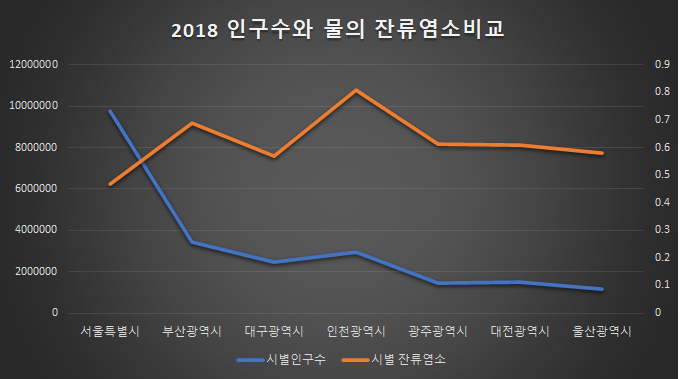
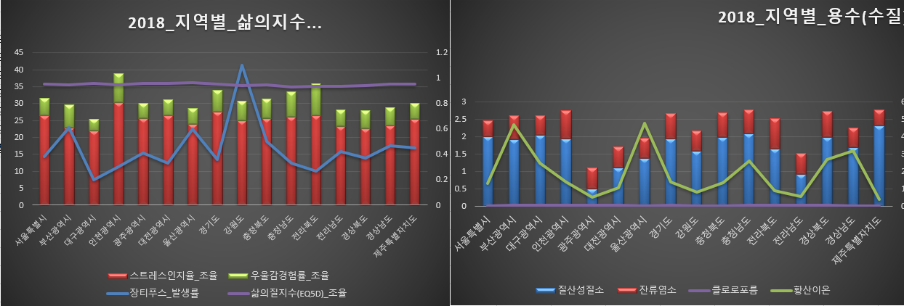

# TEST01

* test입니다.
  * dfw = 물관련
  * dfh = 건강관련
  * dfco = 통합된 데이터
  * 임의의 columns값을 추출하여 시도별로 데이터를 비교하였습니다.
  * 함수및 알고리즘 잘활용하면 더좋게 코드를 짤 수 있을듯....(회의)
  * 엑셀로 데이터를 분석해본결과 데이터관 연관성을 찾을 수 없었음(회의)

